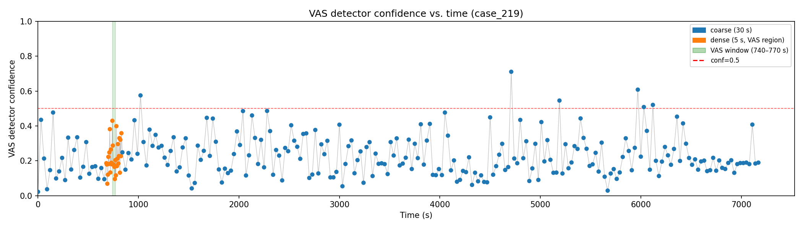

# Surgical Anatomy Segmentation — Custom Pipeline

This branch adds automatic segmentation and tracking of surgical anatomy (prostate gland,
vas deferens) in robotic surgery video (RARP) on top of the base SAM3 codebase.
See `README_SAM3.md` for the upstream SAM3 documentation.

---

## What This Adds

A three-stage pipeline for automatic prostate segmentation in surgical video — no manual
prompts at inference time:

1. **Fine-tuned SAM3 detector** — detects the prostate bounding box from a single frame
2. **Noise-robust SAM2 decoder** — generates a clean initial mask even from an imperfect box
3. **SAM2 video predictor** — propagates the mask through the video via maskmem

The pipeline runs in chunks (default 150 frames). At the start of each chunk the detector
reinitialises the tracker, preventing long-term drift.

---

## Key Scripts

| Script | Purpose |
|--------|---------|
| `infer_prostate.py` | Full pipeline — detector → decoder → tracker, chunked |
| `infer_prostate_bidir.py` | Same but propagates bidirectionally from an anchor frame |
| `infer_vas.sh` | Single-clip VAS deferens inference (wraps `infer_prostate_bidir.py`) |
| `infer_vas_batch.sh` | Batch VAS inference over a list of clips from `untitled.txt` |
| `train_detector.py` | Fine-tune SAM3 detector head on any structure |
| `train_sam2_decoder.py` | Fine-tune SAM2 mask decoder with noisy-box augmentation |
| `detect_segment_fast.py` | Fast prostate pipeline: torch.compile + FRAME_STEP=3 + batch pre-encoding |
| `masks_to_coco.py` | Convert binary mask PNGs to COCO JSON for detector training |
| `aua_tracking/` | Browser annotation tools + SAM2 tracking scripts for AUA presentation |

---

## Checkpoints

| Model | Target | Val IoU | Path |
|-------|--------|---------|------|
| SAM3 fine-tuned detector | Prostate | 0.907 | `detector_training/checkpoints/20260428_0942/checkpoint_best.pth` |
| SAM2 noise-robust decoder | Prostate | 0.919 | `sam2_decoder_training/checkpoints/20260504_1506/checkpoint_best.pth` |
| SAM3 fine-tuned detector | VAS deferens | — | `detector_training/checkpoints/20260522_1403/checkpoint_best.pth` |
| SAM2 noise-robust decoder | VAS deferens | — | `sam2_decoder_training/checkpoints/20260522_1448/checkpoint_best.pth` |

> Checkpoint files (`.pth`) are gitignored. Store on the HPC filesystem or a separate artifact store.

> **Text token:** Both detectors are queried with `"prostate gland"` at inference — including
> the VAS model. The CLIP language backbone is frozen during training, so the text embedding
> is a fixed class label, not a semantic description. The detector learns to associate that
> fixed vector with whichever structure appears in the training data. Passing `"vas deferens"`
> at inference would produce a different CLIP vector and break the trained association.

---

## Dataset

**`prostate_tracker_long_qpr_19`** — 343 paired image/mask frames from robotic prostatectomy.
Located at: `../autosam-instruments-GraSP-trained/sam2/projects/prostate_tracker_long_qpr_19/`

Split: 291 train / 52 val (85/15, seed=42).

`detector_training/data/` contains:
- `annotations_train.json` / `annotations_val.json` — COCO-format box annotations
- `images/` — symlinks to the source JPEGs (HPC paths)

---

## Usage

### Full pipeline inference

```bash
cd /sc/arion/projects/video_rarp/neel_projects/segmentation_prostate/sam3

python3 infer_prostate.py \
    --video /path/to/source.mp4 \
    --detector_ckpt detector_training/checkpoints/20260428_0942/checkpoint_best.pth \
    --decoder_ckpt  sam2_decoder_training/checkpoints/20260504_1506/checkpoint_best.pth \
    --clip_start 3959 --clip_end 3969 \
    --output_dir short_clips \
    --reinit_interval 150
```

### Fast inference (torch.compile + frame-skipping)

```bash
python3 detect_segment_fast.py
```

### Train detector

```bash
python3 train_detector.py --epochs 50 --batch_size 32
```

### Train noise-robust decoder

```bash
python3 train_sam2_decoder.py --epochs 30 --batch_size 4
```

---

## Throughput

Benchmarked on a single NVIDIA H100 80GB:

| Configuration | Throughput |
|---|---|
| Baseline (SAM2-large) | ~16 fps |
| + `torch.compile` `mode="default"` | ~22 fps |
| + FRAME_STEP=3 + batch pre-encoding | **1.18× real-time** (19.06s for 22.5s @ 59.9 fps) |
| Meta upstream target (FA3 + max-autotune) | 32 fps |

Batch pre-encoding (`pre_encode_chunk` in `detect_segment_fast.py`) removes the ViT encoder
from the propagation critical path. All chunk frames are encoded in batches of 8 before
`propagate_in_video` starts — the maskmem loop hits the cache on every frame and never calls
`forward_image`. Masks verified correct.

**Remaining speedups:** `max-autotune`, Flash Attention 3 + FP8, multi-video parallelism.

---

## Streaming / Real-Time Roadmap

Batch pre-encoding does not transfer to streaming — frame N+1 hasn't arrived when frame N
is being processed, so there is nothing to batch ahead of time. The ViT cost returns per frame.

**Irreducible constraint:** maskmem is autoregressive. Frame N's memory token must be written
before frame N+1 can start. This is a hard sequential dependency regardless of parallelism.

**Options ranked by impact:**

| Option | Mechanism | Status |
|--------|-----------|--------|
| **CUDA stream pipelining** | Encode frame N+1 on GPU stream 1 while maskmem runs frame N on stream 2. H100 has enough SMs for both concurrently. `cached_features` is the handoff — encode writes, maskmem reads. Hides ViT cost almost entirely. | Not implemented |
| **Async detector reinit** | SAM3 detector runs in a background thread every ~2.5s. Maskmem loop never stalls waiting for the new box. | Not implemented |
| **Frame skipping** | FRAME_STEP=5/6 — immediate throughput gain, masks go staler. | Config change |
| **max-autotune + FA3+FP8** | ~40% free throughput from Meta's upstream commit. | Not implemented |
| **SAM2-base for propagation** | Smaller maskmem model, faster per step, modest quality impact. | Not implemented |

**Target streaming architecture:**
```
Thread 1 (CPU)         : decode frame → preprocess
Thread 2 (GPU stream 1): ViT encode → write to cached_features
Thread 3 (GPU stream 2): maskmem read cached_features → propagate → emit mask
Thread 4 (CPU, async)  : SAM3 detector reinit every 150 frames (non-blocking)
```

---

## Environment

- Platform: Arion HPC (Linux, LSF)
- Container: `singularity shell --nv --writable /sc/arion/projects/video_rarp/neel_projects/sam3_dev`
- Temp dir: `/sc/arion/projects/video_rarp/neel_projects/tmp_sam3_seg`
- No `nvidia-smi` in PATH — use `torch.cuda.get_device_properties(0)`

---

## Project Timeline

### Phase 1 — SAM2 with Manual Prompts
**What:** SAM2 video predictor + maskmem for tracking. Built a frontend for drawing bounding boxes or masks on frame 0 and propagating through the video at configurable sample rates.
**Worked:** SAM2 maskmem is robustly reliable once initialized with a clean prompt.
**Failed:** Manual prompt required on every new clip — not usable at scale.

---

### Phase 2 — AutoSAM2 (custom decoder, zero prompts)
**What:** Removed SAM2's prompt encoder entirely. Trained a custom `MaskDecoder` + `TwoWayTransformer` on top of the frozen SAM2 Hiera-ViT encoder for zero-shot prostate detection. 343 image/mask pairs.
**Result:** ~mIoU 0.86 on static frames.
**Why it failed for video:**
- No maskmem — each frame is independent, masks flicker/drift.
- The decoder simultaneously solves detection (where?) and segmentation (which pixels?) with only 343 training samples — a ceiling problem.
- Carrying a noisy frame-0 mask into the SAM2 tracker propagates that noise forward.

**Phase 2b — Hybrid (AutoSAM2 init → SAM2 maskmem):**
`prostate_hybrid_track.py` — AutoSAM2 generates frame-0 mask, SAM2 large propagates it. Better than pure AutoSAM2, but ~15% of badly-wrong frame-0 detections still corrupt the tracker seed.

---

### Phase 3 — SAM3 Out-of-the-Box (failed)
**What:** SAM3's CLIP-based language-conditioned detector with text prompt `"prostate gland"`.
**Why it failed:** SAM3's detector uses cross-attention between visual tokens and CLIP text tokens at every transformer decoder layer. `"prostate gland"` is far outside CLIP's training distribution — the text embedding has no geometric prior for surgical anatomy, so cross-attention adds noise rather than signal. Produces unreliable boxes, worse than a manual prompt.

---

### Phase 4 — Fine-tuned SAM3 Detector
**What:** Fine-tuned the SAM3 detector head only (transformer decoder, dot_prod_scoring, geometry_encoder, segmentation_head). ViT + CLIP backbones frozen. 32.7M / 840.5M params. Text query encoded once and cached.
**Result: val IoU = 0.907** (epoch 47/50).
**Why it worked:** Backbones already extract rich features. The decoder only needed to learn prostate geometry — a small learning problem. Fixed text embedding acts as a stable class bias rather than a meaningful semantic anchor.

---

### Phase 5 — SAM3 Detector → SAM2 Tracker Pipeline
**What:** Fine-tuned detector gives a bounding box → base SAM2 video predictor propagates masks via maskmem. Chunked reinit every ~500 frames.
**First result:** `case_213_clipped` 3959–3969s, 299/299 frames masked, conf=0.19.
**Why better than SAM3's own tracker:** SAM2 maskmem is purely geometric — no text cross-attention during propagation. Clean separation: detector = semantic anchor, tracker = temporal interpolator.

---

### Phase 6 — Noise-Robust SAM2 Decoder
**What:** SAM2 mask decoder fine-tuned with deliberately perturbed bounding boxes: 15% tight (±10%), 50% medium (±50%), 25% large (±100%), 10% extreme (full image). Encoder + prompt encoder frozen. Loss: Dice + BCE.
**Result: val IoU = 0.919** (30 epochs).
**Why it matters:** Bridges the gap between imperfect detector boxes (conf=0.19) and a clean mask initialisation for the tracker.

---

### Phase 7 — Full Pipeline Integrated
**What:** `infer_prostate.py` wires all three components — fine-tuned detector → noise-robust decoder → SAM2 video predictor — in a chunked loop with configurable reinit interval.

---

### Phase 8 — Throughput Optimization
Baseline ~16 fps on H100. `torch.compile mode="default"` brought this to ~22 fps. Frame-skipping (FRAME_STEP=3) + batch pre-encoding of the ViT brought this to **1.18× real-time** (19.06s for 22.5s @ 59.9 fps, H100).

**Key bottleneck:** SAM2 maskmem is autoregressive — hard sequential dependency, free VRAM cannot help. GPU is latency-bound.

**Batch pre-encoding (`pre_encode_chunk` in `detect_segment_fast.py`):** The ViT image encoder has zero temporal dependency — all chunk frames are encoded in batches of 8 before `propagate_in_video` starts. The maskmem loop hits `inference_state["cached_features"]` on every frame and never calls `forward_image`. Previously the cache was a single-entry dict (cache miss on every frame during propagation).

**Linear mask interpolation (`detect_segment_fast.py`, rendering step):** With FRAME_STEP=3 only every 3rd frame has a computed mask. Rather than holding the last mask as a static overlay for skipped frames, the renderer linearly interpolates between consecutive keyframe masks. Per-pixel float alpha gives smooth transitions instead of hard cuts every 3 frames. Pre-saved `.npy` keyframe masks are reusable — alpha and interpolation can be changed without rerunning the GPU pipeline (`rerender_overlay.py`).

**Remaining:** `max-autotune`, Flash Attention 3 + FP8, multi-video parallelism. Reference: `facebookresearch/sam3` commit `9f22cb9`.

---

---

## Nerve-Sparing Phase Localisation

> **Note:** This is a standalone research project. It is maintained in this repository for practical reasons — the HPC environment and SAM2 installation are already set up here, and the pipeline uses the SAM2 frozen encoder as its feature extractor.

### Clinical Motivation

The nerve-sparing phase of a robotic prostatectomy (RARP) is roughly 20–30 minutes within a 2–3 hour surgery. Analysing patient outcomes from the full video is impractical — the goal is to automatically extract just that window.

The nerve-sparing phase is bounded by two surgical events:
- **Start:** VAS deferens cutting (the bilateral division of the vas marks the entry into the nerve-sparing dissection). An earlier alternative start is the catheter pull following the anterior bladder-neck incision — both timestamps are available in `intuitive_videos/annotate_fine.csv`.
- **End:** Endobagging (the prostate is placed into a laparoscopic bag for extraction). This marks the completion of the dissection.

### Confidence-Sweep Baseline (failed)

As a first attempt, the trained VAS deferens detector was run across every sampled frame of the full surgery to see if its box confidence peaked during VAS cutting. The resulting trace (`vas_confidence_sweep.png`) showed no clean spike. The detector fires on tubular structures throughout the surgery and is not phase-gated — it cannot distinguish "VAS being cut now" from "VAS is incidentally visible".



### Embedding-Based Approach

Since the SAM2 image encoder is entirely frozen and demonstrably produces features sufficient for pixel-level VAS segmentation, those same features must encode enough signal to classify whether a frame belongs to the VAS-cutting phase. The encoder has never been updated — it generalises across all phases of the surgery.

**Pipeline (identical for both events):**

```
extract_*_features.py   — sample frames → SAM2 forward_image → avg+max pool FPN coarse scales → .npz
train_*_classifier.py   — LOCO-CV with logistic regression on the saved features
localize_*.py           — full-video inference → rolling-mean smoothing → pick highest-confidence segment
```

Feature extraction: the finest FPN scale is discarded (local texture, not useful for phase detection). For the two remaining coarser scales, average and max pooling are concatenated — average captures mean activation, max captures whether a feature is present anywhere in the frame. Final feature vector: **640-d** = `[fpn[1]-avg(256), fpn[1]-max(256), fpn[2]-avg(64), fpn[2]-max(64)]`. The deepest FPN level is 64 channels because SAM2 internally projects it down to `mem_dim` after the FpnNeck — same layout for every Hiera variant.

Annotations for VAS cutting: `intuitive_videos/untitled.txt`.
Annotations for all events including endobagging: `intuitive_videos/annotate_fine.csv`.

### Backbone and feature-slice ablation

Run via `bash run_endobag_size_ablation.sh`. Per-frame LOCO-CV (7 cases):

| Variant | Slice | feat_dim | AUC-ROC | F1 | Accuracy |
|---|:---:|:---:|:---:|:---:|:---:|
| Large | all  | 640 | 0.975 ± 0.023 | 0.685 | 0.898 |
| Large | fpn1 | 512 | 0.950 ± 0.070 | 0.710 | 0.896 |
| Large | fpn2 | 128 | 0.907 ± 0.104 | 0.653 | 0.882 |
| **Small** | **all**  | **640** | **0.964 ± 0.050** | **0.757** | **0.926** |
| Small | fpn1 | 512 | 0.930 ± 0.082 | 0.665 | 0.887 |
| Small | fpn2 | 128 | 0.949 ± 0.046 | 0.748 | 0.905 |

Findings: (i) dropping either FPN scale hurts both backbones — keep all 640-d; (ii) Hiera-Small matches Hiera-Large on per-frame AUC (within fold noise) and is the production choice because it wins on full-video localisation and runs **3.57× faster** at the encoder (measured — see throughput benchmark below).

### Encoder throughput benchmark

Pure-GPU `forward_image` throughput at batch 32, 1024×1024 input, H100 80GB. Script: `bash run_encoder_benchmark.sh`. Synthetic input pre-allocated on the device — no video decode, no preprocessing, isolates encoder work from I/O.

| Variant | Config             | fps    | ms/frame | Peak GB | Speedup |
|---------|--------------------|-------:|---------:|--------:|--------:|
| Large   | fp32 baseline      |  46.46 |   21.52  |  14.88  |   1.00× |
| Large   | + bf16 autocast    |  85.92 |   11.64  |   9.82  |   1.85× |
| Large   | + bf16 + compile   | 131.96 |    7.58  |   9.30  |   2.84× |
| **Small** | **fp32 baseline**  | 151.55 |    6.60  |   9.71  |   1.00× |
| **Small** | **+ bf16 autocast**| 276.37 |    3.62  |   6.76  |   1.82× |
| **Small** | **+ bf16 + compile**| **471.29** | **2.12** | **6.15** | **3.11×** |

**Key results:**
- bf16 autocast alone is ~1.85× over fp32, with no code changes beyond a one-line `torch.autocast` wrapper. The current extraction scripts run fp32 — wrapping `forward_image` is free throughput.
- `torch.compile` (`mode="default"`) on top of bf16 gives another ~1.5–1.7×, total ~3× over the fp32 baseline. Cost: ~30s of graph capture at startup.
- **Hiera-S vs Hiera-L, best config vs best config: 3.57×.** The earlier "~5×" estimate (based on FLOPs ratio) was too optimistic — H100 is latency-bound at this batch size, so wall-clock ratio is closer to ~3.5× than the raw FLOPs would suggest.
- Throughput here is the encoder alone. End-to-end extraction throughput including `cv2.set/read/resize` will be lower since video I/O does not benefit from bf16 or compile.

### Results

**VAS cutting localisation:** within 1–2 minutes of the true event across held-out cases.

**Endobagging localisation (Hiera-S, 7 cases, LOCO-CV):**

| Case | GT start | Selected | Start error | Within 3 min |
|------|----------|----------|-------------|--------------|
| 213 | 4093s (68.2m) | 4096s | +3s | ✓ |
| 214 | 3159s (52.6m) | 3304s | +145s | ✓ |
| 219 | 2632s (43.9m) | 2660s | +28s | ✓ |
| 220 | 3382s (56.4m) | 3386s | +4s | ✓ |
| 222 | 4742s (79.0m) | 4870s | +128s | ✓ |
| 245 | 5501s (91.7m) | 4724s | −777s | ✗ |
| 246 | 5096s (84.9m) | 5100s | +4s | ✓ |

**6/7 (86%) within 3 minutes.** Median error 28s, mean 156s. For comparison, Hiera-L on the same protocol was 5/7 with median 126s, mean 813s — the smaller backbone gives both higher hit rate and ~5× tighter localisation. The remaining failure (case 245) is a structurally similar earlier scene scoring higher than the true endobag; since endobagging is by definition the last sustained event in the surgery, switching `pick_best_segment` to "latest segment above threshold" is the next mitigation.

### Scripts

| Script | Purpose |
|--------|---------|
| `extract_vas_features.py` | SAM2 feature extraction for VAS cutting frames |
| `train_vas_classifier.py` | LOCO-CV classifier evaluation for VAS |
| `localize_vas.py` | Full-video VAS event localisation |
| `extract_endobag_features.py` | SAM2 feature extraction for endobagging frames |
| `train_endobag_classifier.py` | LOCO-CV classifier evaluation for endobagging |
| `localize_endobag.py` | Full-video endobagging event localisation |
| `run_endobag_size_ablation.sh` | End-to-end ablation: Hiera-S extraction + LOCO-CV across `{large, small} × {all, fpn1, fpn2}` |
| `benchmark_encoder.py` / `run_encoder_benchmark.sh` | Pure-GPU `forward_image` throughput across `{large, small} × {fp32, bf16, bf16+compile}` |

---

### Phase 9 — VAS Deferens Detector + AUA Tracking Toolkit

**VAS deferens detector:** Trained a second SAM3 detector on vas deferens annotations using the same architecture and training procedure as the prostate detector. The text query at inference is `"prostate gland"` — identical to the prostate model. The CLIP language backbone is frozen, so the text embedding is just a fixed class label; the model learns to associate it with whatever structure appears in the annotations. Swapping the query string at inference time would break the trained association.

Inference: `infer_prostate_bidir.py` propagates bidirectionally from a detected anchor frame (forward + backward without `reverse=True`, using `ReverseVideoChunkLoader` for the backward pass). `infer_vas.sh` wraps this for a single clip; `infer_vas_batch.sh` iterates over the clip list in `intuitive_videos/untitled.txt`.

**AUA tracking toolkit (`aua_tracking/`):** Browser-based annotation tools and SAM2 propagation scripts consolidated for the AUA presentation. Covers three workflows: brush-mask tracking (nerve bundles), single-instance box tracking (VAS/seminals/retrotrigonal), and simultaneous multi-instance box tracking (both VAS at once, both seminals at once). See `aua_tracking/README.md` for full documentation.
